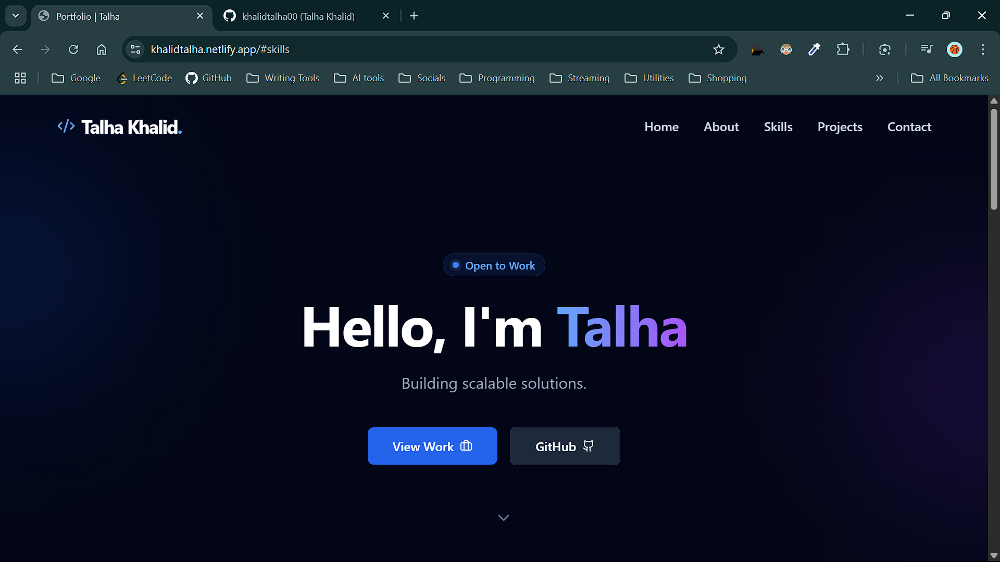
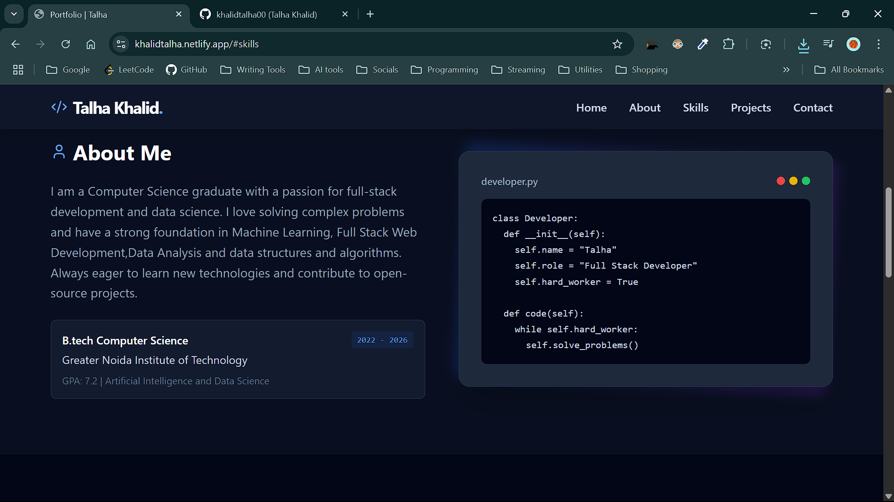
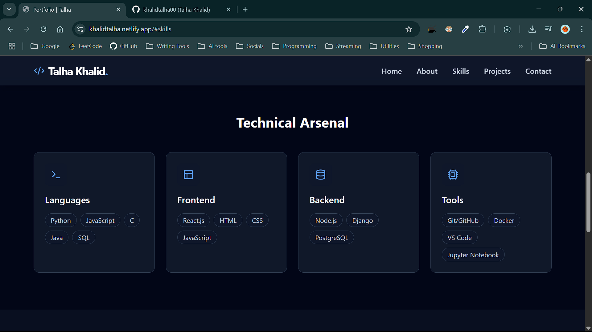
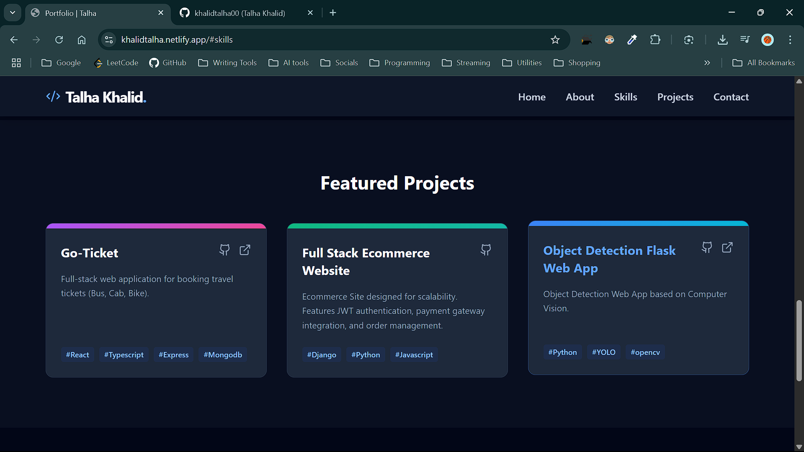
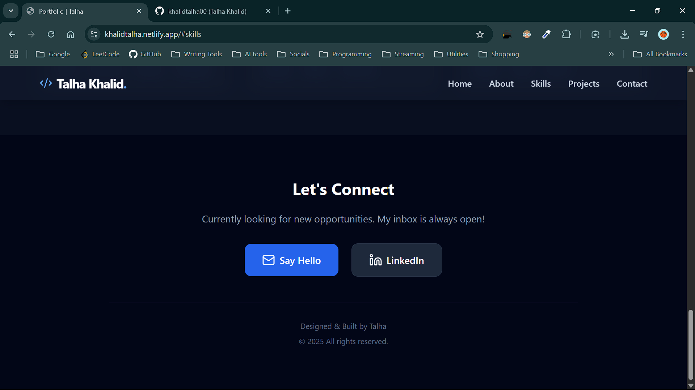

## LIVE LINK
(https://khalidtalha.netlify.app/)
## Screenshots

<!-- Add screenshots of your portfolio here -->

## Features

- Responsive design
- Interactive elements
- Project showcase

## Setup

1. Clone the repository.
2. Open `index.html` in your browser.
